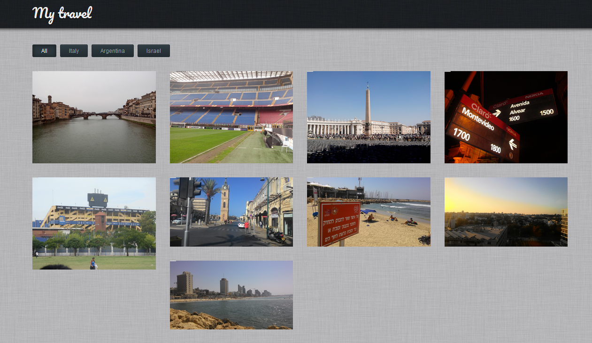
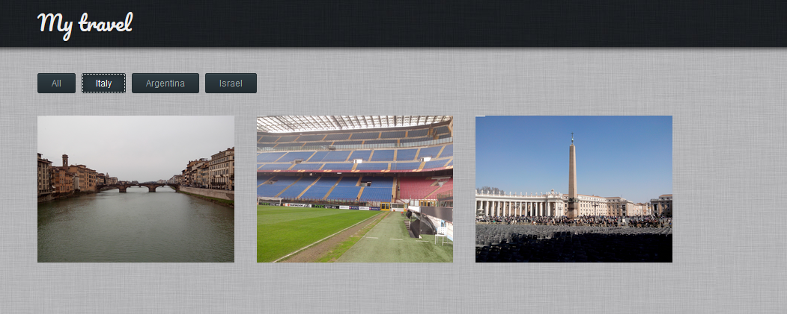
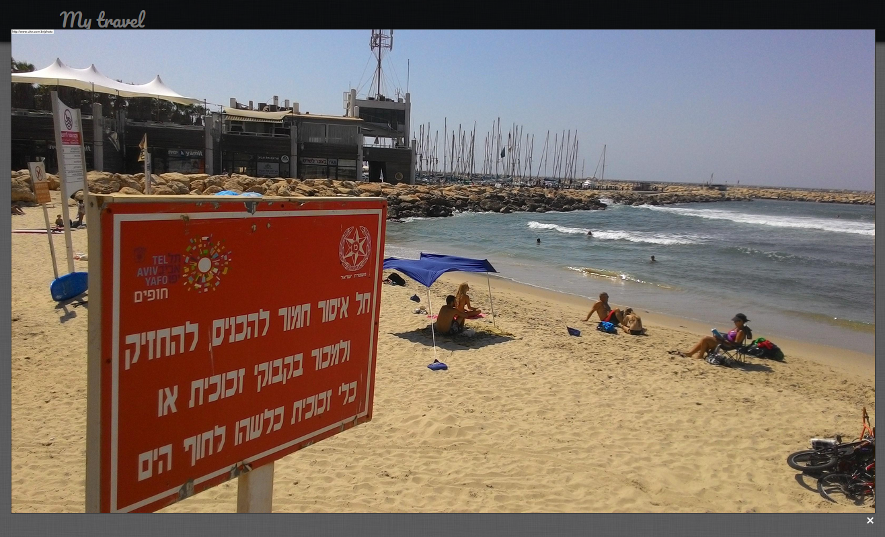
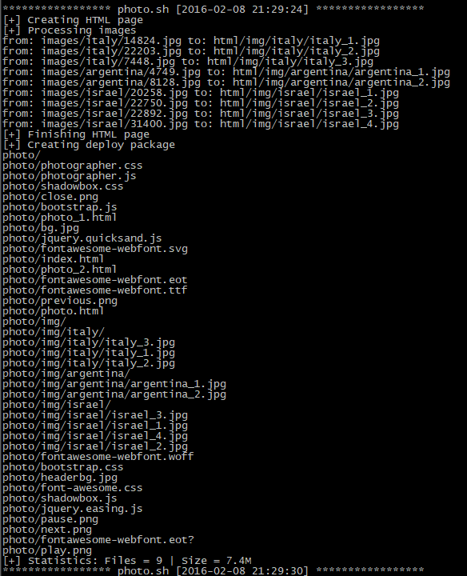

# My Travel

## Description
Publish your photos as customizable album.\
It's currently being presented as **travel**, but it could be used for any other purpose.

## How it works
1. Create image folder
2. Create sub-folders - which will be used as tags and sessions
3. Go to bin and run **photo.sh**
4. HTML pages will be created automatically
5. Under **deploy** you will find prepared package

## Screeshots
\
\
\
\
